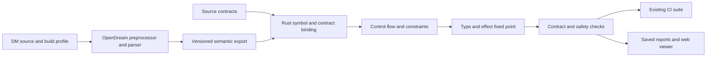

# Proposed static type system for DM

Status: design proposal, 2026-09-23. This document describes intended behavior,
not capabilities already implemented by `dm-health`. Comment syntax marked as
proposed below requires implementation. The implementation remains in this Rust
tool, with OpenDream providing the DM frontend through the existing .NET bridge.

## 1. Policy and guarantee

Adopt a strict, nominal type system over ordinary DM. Each storage location has
one stable type. Subtypes are allowed; unrelated runtime categories are not.
Null is allowed only by an explicit nullable contract. Inference fills in missing
types, but it does not silently make a field nullable or widen an API to make
incorrect assignments pass.

The guarantee applies to the analyzed build configurations, checked entry points,
and versioned runtime/library models. DM still executes the original source.
Comments do not change runtime assignment, access control, or deletion behavior.
Unmodeled native operations, reflection, and unchecked ingress must appear as
unresolved obligations or explicit trust boundaries. They cannot count as proven
safe merely because the analyzer did not find a concrete counterexample.

In strict modules, an incompatible assignment, possible null dereference, missing
initialization, or unresolved operation needed to establish safety is a CI error.
Size, coupling, and similar engineering metrics remain separately configurable.

Two kinds of inference must be distinguished:

- **Discovery:** summarize what legacy code appears to do, with evidence and gaps.
  A nullable observation is a migration suggestion, not an accepted contract.
- **Enforcement:** solve for the one permitted type, then validate every relevant
  assignment, call, return, and override against it. Missing evidence is a failure
  to prove the contract, not success.

## 2. Stable types and current values

Track the declared or inferred storage type separately from facts at a particular
program point. A variable can have storage type `/obj/item`, while a successful
`istype` check proves that its current value is `/obj/item/tool` in one branch.
That does not change which later assignments the variable accepts.

| Type concept | Meaning |
| --- | --- |
| `num`, `text`, resource/builtin types | DM value categories, without implicit conversion between unrelated categories |
| `/obj/item` | An instance of this type or an actual subtype |
| `/obj/item?` | The instance type plus null |
| `typepath</obj/item>` | A type path for an item subtype, not an item instance |
| `list<T>` | A DM list used as a sequence of values of type T |
| `assoc<K,V>` | A DM list used as a mapping with keys K and values V |
| `alist<K,V>` | BYOND's associative-only `/alist`, including numeric keys; distinct from a regular list |
| `record<Schema>` | A DM list with a declared key schema, including optional keys |
| `proc<(Args) -> Result>` | A proc reference with a checked receiver/argument/result contract |
| `unknown` | Insufficient information; requires narrowing or a boundary adapter |
| `void` | A proc result that callers must discard; not a value storage type |
| `never` | No normal return; used internally for control flow |

`bool` may be a refinement of `num`; it is not a new DM runtime category.
Builtin types such as `/list`, `/client`, `/world`, `/icon`, and `/savefile` need
their actual versioned relationships and member definitions. Do not assume that
every slash-prefixed value is an ordinary `/datum` instance.

Build subtyping from the effective inheritance graph, including `parent_type`.
Textual path prefixes are insufficient. BYOND explicitly allows the inheritance
tree to differ from the source path tree. [BYOND inheritance documentation](https://www.byond.com/docs/guide/app5.html)

For inference, join assigned object types at their nearest common ancestor. Two
tool subtypes can infer their shared tool base. A number and a tool have no
acceptable ordinary storage type. Do not resolve that conflict to `anything`.
If the only inferred ancestor is a configured broad root such as `/datum` or
`/atom`, require an explicit type choice and explain which writes forced it.
Intentional broad storage remains legal, but its subtype members require guards.

Do not add general implicit unions in the first implementation. Use common bases,
separate variables, or tagged datums for application alternatives. Finite unions
can be internal to builtin overloads and validated boundary schemas; they must
not become an automatic escape from the single storage type rule.

## 3. Where inference gets its evidence

Create constraints from both producers and consumers. An assignment requires
`type(value) <: type(slot)`; a call adds the equivalent constraint against each
parameter. A member access requires a valid member on the receiver. Unknown
receivers must not be guessed from a globally matching field or proc name.

| Location | Evidence and required checks |
| --- | --- |
| Local | Initializer, every assignment, branch/loop joins, call results, and uses; one storage type for its lexical lifetime |
| Field/static/global | Effective initializer, all direct and indirect writes, subtype value overrides, construction, map values, loaders, and reflective writes |
| Parameter | Explicit/native declaration, defaults, body constraints, positional/named callers, callbacks, engine entry contracts, and override family |
| Proc return | Every normal exit, explicit returns, the implicit `.` result, parent calls, recursive dependencies, and runtime dispatch targets |

Native DM path declarations supply type constraints. DM input filters and `as`
metadata must retain their distinct language meanings; they are not automatically
proof that every ordinary caller supplies a value of the requested type.
At an unchecked proc entry, treat each parameter as possibly null even if its
storage contract is non-null. An omission, explicit null, or external caller can
reach that entry; a local guard can establish a non-null flow fact. The same
entry fact must feed return inference, field-write evidence, and call-site
evidence so those passes cannot silently recover a stronger claim.

For private/internal parameters, complete checked call sites can contribute to
inference. A public proc, callback, verb, or engine hook needs a stable signature
and a checked entry contract even if current source callers all pass one type.
Use annotations or a reviewed exported API snapshot for these interfaces. The
tool may propose that snapshot, but CI must not silently regenerate a wider API
because a new caller supplied an incompatible argument.

Inference runs to a fixed point across mutually recursive proc groups and field
dependencies. Unseeded cycles remain unresolved; they must not infer `never` or
non-null just because no concrete result was discovered. Termination limits must
produce an explicit precision/coverage diagnostic rather than dropping targets.

The solver records why each type was selected: contributing assignments,
constraints, selected common ancestor, and unresolved writers/callers. This is
needed for both diagnostics and incremental invalidation.

## 4. Nullability and initialization

Strict fields, parameters, and value-returning procs default to non-null. `T?` or
`nullable` explicitly permits null. A nullable annotation permits null values; it
does not permit dereferencing them without a guard. An annotation also does not
turn an unresolved type into a known type.

Locals use definite assignment. A declaration without an initializer can exist
temporarily before assignment, but reading it before every incoming path assigns
a valid value is an error. The analyzer must still model DM's actual default
null underneath; it cannot pretend the runtime holds a valid object. Explicitly
assigning null to a local requires a nullable local contract as well.

For fields, support explicit lifecycle contracts:

1. An initializer establishes the live value immediately, subject to constructor
   effects and effective subtype overrides.
2. An `initialized-by` contract allows a temporary uninitialized state until a
   named, modeled initialization phase completes.
3. Every successful construction path must initialize required fields before
   ordinary reads or publication. Failed/deleted construction is not a live object.
4. Passing an incompletely initialized `src` to an unknown proc, registering it in
   a global, invoking an overridable method that may read uninitialized state, or
   suspending while it is exposed creates an initialization obligation.

Model this repository's `Initialize`, any late initialization, `Destroy`, and
parent chaining from their real call sequence. Annotating `initialized-by
Initialize` alone is not proof. Maps and loaders can bypass ordinary construction
assumptions and must be included or validated at their boundary.

Teardown bodies are outside this type policy. `Destroy` and `Del` writes are
excluded from storage-type inference and strict field assignment checks. Code
that continues to run after deletion still loses any reference-liveness proof.

The repository deliberately uses nullable lazy lists. Preserve that convention:
`list<T>?` is valid, `LAZYADD` can establish a non-null list, and `LAZYREMOVE` can
make it null again. Do not fix nullability by allocating an empty instance list
everywhere. See [`_lists.dm`](../../../code/__defines/_lists.dm).

For arguments, omission, defaults, and an explicitly passed null are separate
inputs to the call binder. A default does not by itself prove a parameter is
non-null. Preserve the exact behavior of the pinned DM version, including named
arguments, `args` mutation, `arglist`, and parent argument forwarding. [BYOND proc reference](https://www.byond.com/docs/ref/info.html#%2Fproc%2Farguments)

For returns, `.` starts null and can be assigned. Analyze explicit returns,
bare returns, and fallthrough through the actual result-slot semantics. A proc
with one value-returning branch and another path that leaves `.` null cannot
infer a non-null result. A `void` proc may finish with DM's null result, but using
that result as a value is an error. [BYOND result variable reference](https://www.byond.com/docs/ref/info.html#%2Fproc%2Fvar%2F.)

## 5. Guards, aliasing, and object deletion

Track flow facts for definite assignment, current subtype, null state, lifecycle
state, and aliases. Build a real control-flow graph with branch joins, loops,
early returns, exceptions, short-circuit evaluation, and reachable exits.

Recognize `isnull`, exact null comparisons, `istype`, `ispath`, and modeled
repository guards. A truthiness test can establish non-null on its true branch,
but its false branch is not generally proof of null: zero and other false values
must keep their own types. A downcast requires a preceding type guard or a
validated conversion. Assigning to a natively typed DM variable is not a runtime
cast check.

Deletion makes this more demanding than ordinary nullable annotations. BYOND
nulls existing references when their object is deleted. A local alias does not
keep that object alive. [BYOND deletion semantics](https://www.byond.com/docs/guide/chap07.html)

Keep two independent questions visible:

- Does the storage contract allow deliberate absence (`T?`)?
- Is the current reference still known non-null and usable at this point?

Engine-managed fields and implicit variables need their own contracts. For
example, `usr` must not be assumed present in arbitrary procs, and optional or
externally changing fields such as `client` and `loc` must keep their real null
and mutation behavior. A type annotation on the containing object does not make
its members non-null.

Consequently, even a required `T` reference can need revalidation after a call
that could destroy it. A declared non-null field is not an immortality promise.
If another proc can intentionally destroy the required target while its holder
stays live, either express that absence as nullable or define and check a protocol
that repairs/replaces the target before the holder is observable again. A
persistent guarantee otherwise requires checked lifetime restrictions.

Infer conservative effect summaries: may suspend, invoke callbacks, write fields
or collections, destroy reachable objects, and retain/escape references. At a
call, invalidate only the facts affected by known effects. At an unknown call,
invalidate facts for the reachable mutable/aliased state it may affect. Across
`sleep`, input, timers, or asynchronous work, invalidate externally changeable
state and deletable-reference proofs unless a modeled lifetime restriction
preserves them. Suspension does not erase stable numeric local facts.

Recognize this repo's `QDELETED` as a combined null/deletion-state test. `qdel`
means a possible lifecycle transition, not necessarily immediate engine deletion;
honor special outcomes from its implementation. `QDEL_NULL` also explicitly
clears its operand. Copying a field into a local stabilizes which reference was
read, but does not protect the referenced object from deletion. See
[`qdel.dm`](../../../code/__defines/qdel.dm).

For example, a successful target check before `sleep()` does not justify using
the target afterwards. The checker should point to the check, the suspension
that invalidated it, and the later access. A fresh `QDELETED`/null check after
resumption can reestablish the relevant facts.

## 6. Collections and dynamic behavior

DM collections need semantic models; adding an element label to `/list` is not
enough. Sequence indexing requires a valid index. A missing associative key has
an optional result, even when stored values are non-null. A required record key
can have a non-null result only after schema validation or proven construction.

Mutable collections are invariant: allowing `list<Child>` to become a writable
`list<Parent>` would let another alias insert an incompatible sibling. A verified
read-only view may be covariant. A readonly field binding is not a read-only list.
The current checker checks fresh `list(...)` or `alist(...)` field declaration
initializers, subtype overrides, direct field writes, and call arguments entry
by entry against their collection contract. A compatible fresh field literal
contributes evidence at the declared type, avoiding false conflicts between
sibling subtype literals.
This rule does not widen an existing mutable collection. An unknown literal
entry remains unresolved, and a wrong entry is a type assignment error.
An empty list starts with an element type variable constrained by its uses; if
it escapes without enough constraints, require an element annotation.

For a fresh keyed literal with heterogeneous values, an explicit
`record<name:type,optional?:type>` contract checks each named entry, rejects
unexpected names, and requires non-optional names. Nested fresh collections
are checked recursively. `oneof<num,text>` is an explicit finite value union
for DM fields that genuinely use both forms. A computed record key or a dynamic
copy between mutable records remains unresolved until key/value correlation
and alias effects are proved. Reusable comments can declare
`// dm-health: alias Stage = record<...>` and refer to `@Stage` in later
contracts. `merge<record<...>,record<...>>` combines disjoint schemas; overlap
is unresolved. The analyzer proves the exact fresh record builder pattern in
`chem_stage`: named parameters initialize required keys, and a guarded loop
copies optional `extra[key]` to the same result key. Changing that loop's key,
adding work, or overlapping required and optional keys removes the proof.
Fields copied from externally callable parameters remain nullable in the
inferred return schema unless the procedure checks them at entry.

Model list copies, insertion/removal, append/spread semantics, `Cut`, `len` writes,
membership, iteration, and mutation through aliases. Increasing length may create
null entries. Typed filtered iteration narrows the loop value without proving
the whole input list is homogeneous. `as anything` iteration needs evidence from
the list's actual element type. Hybrid lists need an explicit mixed/schema model
or a boundary adapter, not an invented homogeneous type.

| Dynamic operation | Checked treatment |
| --- | --- |
| `call` with a known proc reference or finite targets | Check arguments against every possible target; join results; combine effects |
| Callback/signal/timer registration | Preserve receiver, signature, captured argument types, target set, and execution-time lifecycle requirements |
| `new path_variable(...)` | Require a checked `typepath<T>` and a compatible constructor for every possible target; account for deletion during initialization |
| `vars["literal"]` | Resolve the real field and apply its type, visibility, nullability, and write rules |
| Computed `vars[name]` | Resolve finite keys; otherwise require a schema/adapter and record unresolved reflective effects |
| `arglist` / mutable `args` | Check the argument shape and names; unknown packs remain an obligation |
| `locate`, weak reference resolution, dynamic lookups | Return optional values with whatever type bound can actually be proved |
| JSON, savefiles, SQL, Topic data, FFI | Return unknown/schema input until validated or covered by a versioned trusted contract |

A runtime validator checks the value and establishes the type, including element
types and required keys when claiming a collection/schema type. `istype(x,
/list)` alone proves none of those contents. Shared mutable data can also lose
its schema guarantee through unchecked aliases; copy, control mutation, or
revalidate as necessary.

An explicitly unsafe boundary requires a narrow scope and reason, is reported,
and does not count as statically verified. A comment claiming a type is a
constraint to check, not an unchecked cast. Arbitrary reflective writes cannot
coexist with a claimed complete proof of field invariants.

## 7. Inheritance, visibility, and globals

Mutable inherited fields retain the same storage contract in subtypes. Subtypes
may supply compatible values but cannot make a non-null base field nullable or
narrow writable storage in a way that breaks base-class callers.

Overrides must accept every input accepted by the base signature and return
values satisfying its result contract. They cannot strengthen argument
preconditions, weaken return non-nullability, add required parameters, change
supported named-argument names incompatibly, or exceed promised effect bounds.
Dynamic dispatch uses all viable implementations. A known exact receiver can
use a narrower target set; a base receiver cannot borrow only the base body's
return summary.

Apply public/protected/private rules after real name and inheritance resolution,
including resolved reflective accesses. These are checker policies with the
existing semantics: private to the declaring type, protected to its subtype
family. Module ownership is a separate access concept and should have a distinct
module-internal annotation if desired. One annotation should not ambiguously
mean both type-private and module-private.

Use the same typing rules for globals. Prefer readonly singleton bindings and
private mutable state behind owner procs. A singleton does not make its fields
immutable or remove aliasing effects. Require bootstrap initialization for
required global bindings; track mutation through methods and list aliases. A
readonly binding only prevents rebinding and cannot promise that the referenced
object will never be deleted.

## 8. Proposed comment syntax

Keep native DM paths wherever they express the intended nominal type. Extend
`dm-health` comments for missing information; preserve existing short forms as
aliases. All additional forms here are proposed:

```dm
/datum/example
    // dm-health: private
    // dm-health: nullable
    var/obj/item/target

    // dm-health: private
    // dm-health: type list</obj/item>?
    var/list/pending_items

    // dm-health: initialized-by Initialize
    var/datum/controller/controller

// dm-health: param item /obj/item
// dm-health: returns num
/datum/example/proc/Accept(item)
    return item.w_class

// dm-health: returns /obj/item?
/datum/example/proc/FindTarget()
    return target
```

The example type paths and members are illustrative; `initialized-by` requires
the appropriate lifecycle model for that type. `nullable` is shorthand for
making the selected declaration's type optional; `nullable(name)` targets a
parameter. Existing `nonnull` is redundant but legal in strict mode. Contradictory
annotations, unknown annotation names, and unattached contracts are errors.

Bind annotations to declaration identities and source spans from the frontend,
including indented declarations and macro-generated declarations. A source
comment lexer is appropriate for comment syntax, but regex matching of DM
declarations must not be the binding authority. Preserve macro origin and
expansion context or report that the attachment is unsupported.

## 9. Implementation architecture



Extend the bridge export with type declarations, actual parent relationships,
field value overrides, declaration order, stable identities, source ranges, and
macro/include provenance. Reuse OpenDream's semantic structures where available
through a pinned adapter; a parsed AST by itself does not provide this checker.
Retain all valid definitions needed for DM override and parent-call semantics.
Never certify an AST produced through parser recovery or omitted unknown nodes.

Replace string-based compatibility and recursive AST walking as the safety core
with typed Rust data structures and explicit IR/CFG operations. Suggested files:

```text
tools/dm-health/src/typing/
    mod.rs          orchestration and versioned public results
    types.rs        interned types, subtyping, joins, collection variance
    bind.rs         declarations, scope, overrides, annotation attachment
    cfg.rs          evaluation order, branches, loops, implicit result slot
    constraints.rs  producers, consumers, inference evidence
    solve.rs        recursive groups, fixed points, dependency invalidation
    flow.rs         narrowing, definite assignment, aliases
    effects.rs      writes, escaping references, suspension, deletion
    models.rs       DM builtins and repository-specific library contracts
    diagnostics.rs  proof failures and provenance
```

Pin the OpenDream version, BYOND target, bridge schema, defines, include order,
module policy, builtin models, and source/contract hashes in report/cache identity.
The current bridge selects one build profile; production/test/map profiles need
explicit separate analysis if they are to be covered. Check DMM initial values
and dynamic map/loading adapters when claiming field invariants, not just DM
source assignments.

Cache proc IR and solved summaries in Rust. Recheck affected callers, override
families, field readers/writers, and escaped aliases when a summary changes. A
hierarchy, global macro, or model change can invalidate much more. An AST cache
must include all preprocessor dependencies; parsing a changed file in isolation
is not a generally valid DM incremental strategy. Report frontend and analyzer
times separately and label full versus reused work.

The present implementation is a foundation, not this system: `symbols.rs` stores
type names as strings and infers only narrow simple returns; `ast.rs` tracks a
subset of local flow and currently permits unknowns in compatibility checks.
Inheritance lookup currently follows path prefixes. These need replacement before
strict results can be described as comprehensive.

## 10. Adoption, diagnostics, and the viewer

README files continue to be the only module-boundary markers. A tool policy file
can select strict modules by those discovered roots; it must not invent new
boundaries. Types reopened across folders retain declaration ownership and
inherited contracts. A legacy override cannot weaken a strict base contract just
because its source lives outside a strict module.

Start with discovery, then enable strict enforcement for selected modules. Check
incoming and outgoing boundary obligations and all dependencies needed for their
proofs, even when implementation bodies are outside the selected module. Existing
warning baselines support migration but do not make unverified code verified.
Eventually require strict mode for all maintained application code, with a small,
visible set of trusted runtime/adaptor contracts.

Useful diagnostics include incompatible writes with both producer locations,
implicit broadening, unannotated null, read before initialization, incomplete
returns, bad overrides, unknown argument packs, unsafe downcasts, reflective
writes to protected storage, stale guards after suspension, and invalidated
references after deletion. Every diagnostic should explain the lost or violated
contract and offer the smallest valid repair. Never suggest a blanket `unknown`
annotation or suppression as the primary fix.

In the existing source viewer, show declared/inferred storage type, current flow
type, null/lifecycle facts, and why they were inferred. Link unknown values back
to their source: missing model, reflective read, untyped collection element,
external caller, cyclic constraints, or unsupported AST. Group fixes by shared
root cause so one missing callback signature does not present as hundreds of
unrelated problems.

Record declaration type coverage, expression type coverage, call target coverage,
discharged null/lifecycle obligations, and checked API boundaries separately.
Keep inferred, explicit, validated-boundary, trusted, unresolved, and unsafe
counts distinct. A slash-path annotation, a resolved receiver, or an explicit
`unknown` is not equivalent to a fully verified operation. Include broad types
and collection precision in quality metrics rather than gaming one percentage.

Reports need a schema revision, build/profile identity, policy/model versions,
type provenance, and comparable history. Preserve older report loading and mark
unavailable historical metrics instead of inventing zeros. CI continues through
the existing `ci-suite`; typing findings participate in its report and strict
exit status alongside the other repository checks.

## 11. Delivery sequence and acceptance

| Stage | Deliverable | Required evidence |
| --- | --- | --- |
| 1 | Semantic export, real hierarchy, annotation binding, builtin type catalog | Explicit `parent_type`, reopened definitions, macro declarations, effective field overrides, maps/profile identity |
| 2 | CFG, local storage inference, non-null policy, implicit return analysis | Joins, loops, early exits, zero-vs-null, missing returns, `.` and parent return behavior |
| 3 | Field/parameter/return constraints, call graph, override checks | All-writer inference, named/default/omitted arguments, recursion, dynamic dispatch, stable APIs |
| 4 | Effects, aliasing, initialization and deletion | Initialization escape, callbacks, `sleep`/input, `qdel`, invalidated aliases |
| 5 | Collections, dynamic target sets, schemas and adapters | List invariance, absent keys, list growth, `arglist`, reflection, callback captures and FFI ingress |
| 6 | Strict module rollout, explanations, saved coverage and caches | Boundary failures are errors; unsafe/unknown counts stay visible; incremental and full results agree |

Stages can provide advisory diagnostics as they arrive. A module earns the full
strict guarantee only once every feature it uses is modeled or rejected with an
explicit obligation. Do not switch a feature off merely to produce a clean run.

Use small DM fixtures compiled/parsed through the actual pinned OpenDream bridge,
then checked by Rust. Use Windows BYOND fixtures for uncertain runtime semantics
(argument binding, result slots, deletion and collection behavior), together with
Rust tests for constraint solving and proof invalidation. Do not rely solely on
handwritten JSON AST fixtures. Run full repository analysis to assess coverage and
diagnostic usefulness; test CI integration in CI.

Required negative fixtures include a sibling assignment after a narrower field
declaration, null on one return path, a subtype nullable override, an unchecked
external caller, list corruption through a wider alias, field mutation between a
guard and a read, and deletion through an alias across suspension. Positive
fixtures must prove that valid guards, common-base inference, lazy-list helpers,
compatible overrides, and finite dynamic dispatch do not produce false errors.

The completion target is complete accounting: every operation is checked,
validated at a boundary, explicitly trusted, or reported as unresolved/unsafe.
Only the checked subset may claim static proof. Full coverage cannot mean that
the tool relabeled unknowns until the counter reached zero.

## References and design precedents

The frontend remains [OpenDream](https://github.com/OpenDreamProject/OpenDream),
already integrated by this tool. Use its actual exported nodes and pinned
behavior rather than adding a second DM parser.

The separation of nullable declarations from flow facts follows the useful parts
of [C# nullable analysis](https://learn.microsoft.com/en-us/dotnet/csharp/fundamentals/null-safety/nullable-reference-types).
Local guard and control-flow refinement follows the pattern described in
[TypeScript narrowing](https://www.typescriptlang.org/docs/handbook/2/narrowing.html).
DM additionally requires explicit treatment of deletion, lifecycle, and mutable
reflective state as described above.
